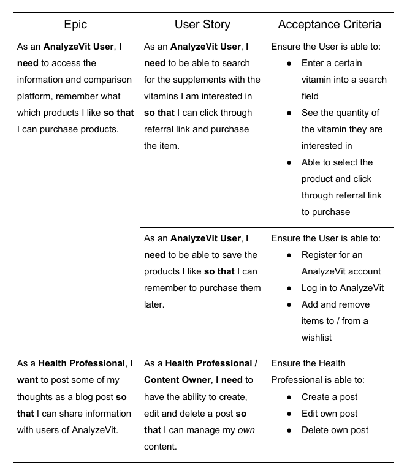
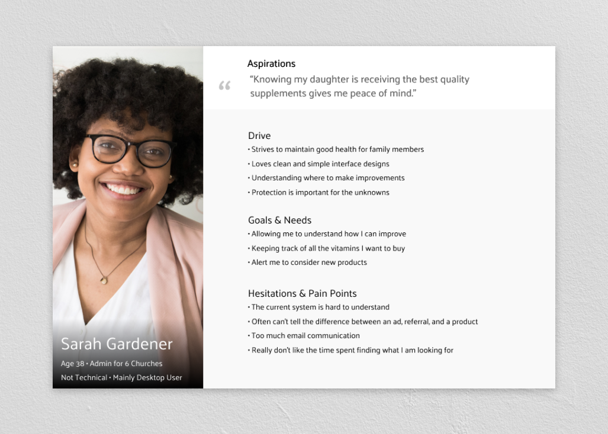
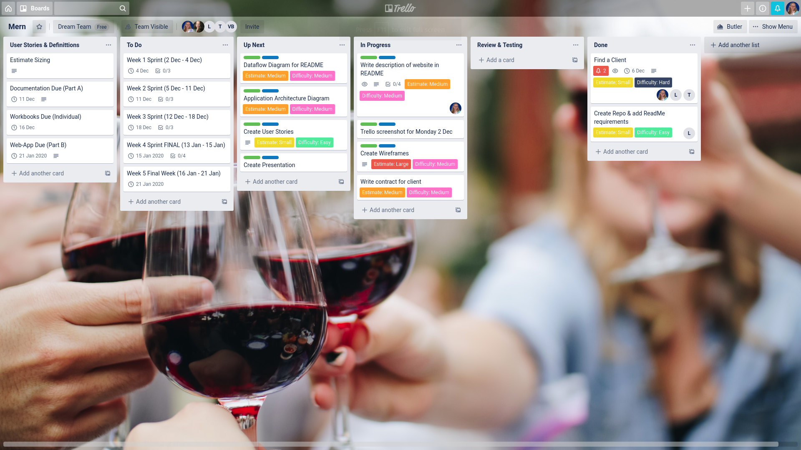
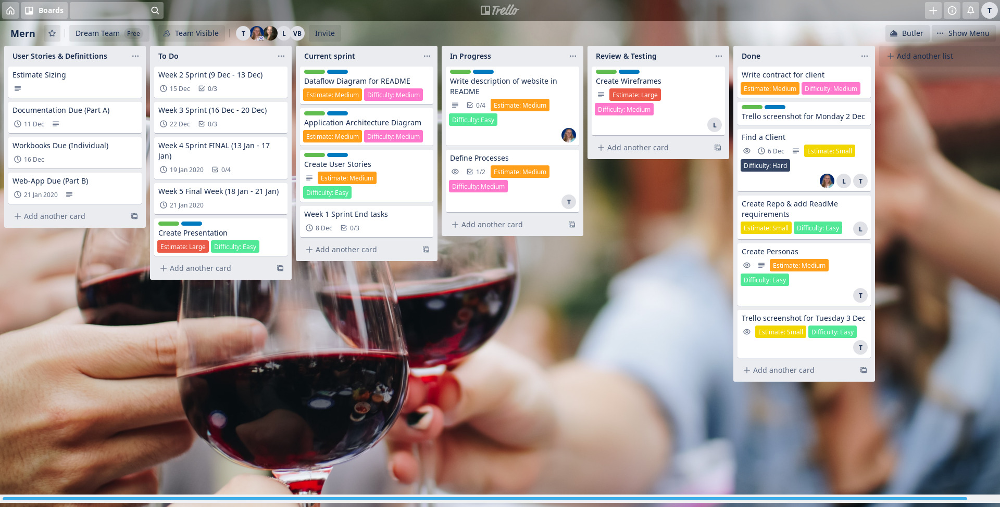

# MERN Assessment

## Authors

* **Carlie Hamilton** – [BlueCodeThree](https://github.com/BlueCodeThree)
* **Lelani Parker** – [Lelani82](https://github.com/Lelani82)
* **Tony Huynh** – [t-hnh10](https://github.com/t-hnh10)

## AnalyzeVit

### Purpose

The purpose of AnalyzeVit is to provide a resource for the general public to compare vitamin content of the many products available on the market. The client identified a void in the market, especially in Australia, which has generally seen a multitude of cumbersome websites lacking simplicity and usability.

It is often an incredibly overwhelming experience when comparing multiple vitamins and supplements simultaneously, especially when the products are multivitamins. The labelling, packaging and provision of health information is generally inconsistent that can further add to the confusion. AnalyzeVit aims to solve this confusion by providing information from a large data set to the public in a consistent and usable format.

### Functionality / Features

Some of the proposed features include:

* A search function
* A blog
* A user login section and the ability to save vitamins to a wishlist/comparison list

### Target Audience

While the expected audience could be vast, the target audience for this MVP is a young, urban professional.

## Tech Stack

MERN duh.

Our tech stack will be:

Database: Mongo DB
Backend: Node with Express
Frontend: React

## Dataflow Diagram

## Application Architecture Diagram

## User Stories

### User Personas

To assist with the writing of User Stories, User Personas were created in order to allow the team to learn about and focus on the spectrum of goals and needs of our users. 

## Wireframes

## Trello Board Screenshots

Monday 2 Dec 2019

Tuesday 3 Dec 2019

Wednesday 4 Dec 2019

## Planning Methodology